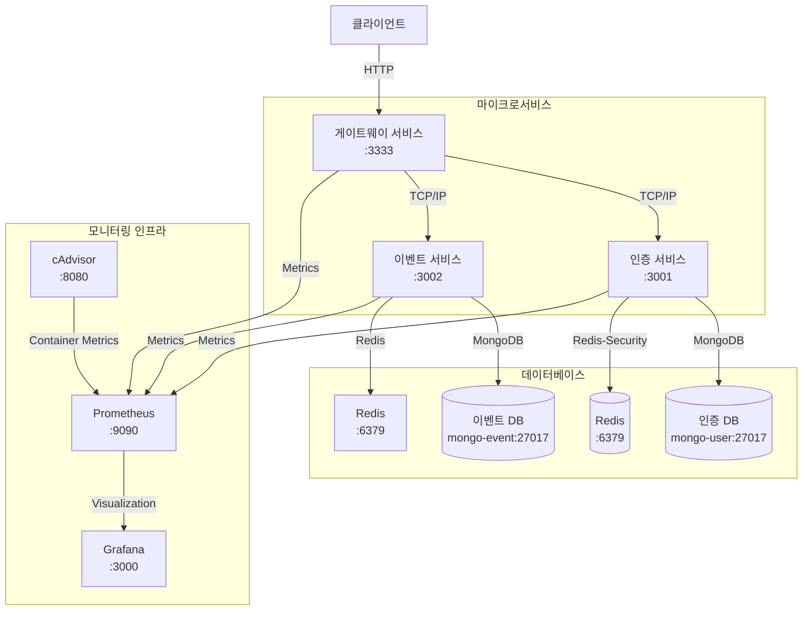

# 이벤트 리워드 플랫폼

NestJS를 사용한 이벤트 및 리워드 관리를 위한 마이크로서비스 기반 애플리케이션입니다.

## 프로젝트 개요

이 플랫폼은 사용자들이 이벤트에 참여하고 리워드를 획득할 수 있는 서비스를 제공합니다. 주요 기능으로는:

- 관리자 및 운영자를 위한 이벤트 관리 대시보드
- 사용자 인증 및 권한 관리
- 이벤트 생성 및 관리
- 리워드 요청 및 승인 프로세스

## 시스템 아키텍처

이 플랫폼은 세 가지 주요 마이크로서비스로 구성됩니다:

1. **게이트웨이 서비스**: API 게이트웨이 역할을 하며 클라이언트의 HTTP 요청을 처리합니다.
2. **인증 서비스**: 인증 및 사용자 관리를 담당합니다.
3. **이벤트 서비스**: 이벤트 및 리워드를 관리합니다.

### 시스템 아키텍처 다이어그램



## 프로젝트 구조

```
event-server/
├── apps/                    # 마이크로서비스
│   ├── gateway/             # API 게이트웨이 서비스
│   ├── auth/                # 인증 서비스
│   └── event/               # 이벤트 서비스
│       ├── src/
│           ├── controllers/ # API 컨트롤러
│           ├── services/    # 비즈니스 로직
│           ├── entities/    # 데이터 모델
│           ├── processors/  # 데이터 처리기
│           ├── events/      # 이벤트 핸들러
│           ├── database/    # 데이터베이스 설정
│           ├── interceptors/# 요청/응답 인터셉터
│           ├── common/      # 공통 유틸리티
│           ├── app.module.ts# 모듈 설정
│           └── main.ts      # 애플리케이션 진입점
├── packages/                # 공유 라이브러리
│   ├── cache/               # 캐싱 관련 패키지
│   ├── cmd/                 # 커맨드 라인 유틸리티
│   ├── decorator/           # 커스텀 데코레이터
│   ├── dtos/                # 데이터 전송 객체
│   ├── enums/               # 열거형
│   ├── eslint-config/       # ESLint 설정
│   ├── filter/              # 예외 필터
│   ├── logger/              # 로깅 유틸리티
│   ├── message-broker/      # 메시지 브로커 관련 패키지
│   ├── metrics/             # 메트릭스 관련 패키지
│   ├── pagination/          # 페이지네이션 유틸리티
│   ├── pipe/                # 커스텀 파이프
│   ├── test/                # 테스트 유틸리티
│   ├── tsconfig/            # TypeScript 구성
│   └── types/               # 타입 정의
├── docker/                  # Docker 구성 파일
│   ├── docker-compose.yml           # 기본 서비스 구성
│   ├── docker-compose.k6.yml        # k6 테스트 구성
│   └── docker-compose.log.yml       # 로깅 인프라 구성
├── infrastructure/          # 인프라 설정 파일
│   ├── grafana/             # Grafana 구성
│   ├── loki/                # Loki 로그 집계 구성
│   ├── prometheus/          # Prometheus 모니터링 구성
│   └── alloy/               # 추가 인프라 구성
├── scripts/                 # 유틸리티 스크립트
├── keys/                    # 암호화 키
└── test/                    # 테스트 파일
```

## 핵심 기술 스택

- **백엔드 프레임워크**: NestJS (TypeScript)
- **데이터베이스**: MongoDB, Redis
- **통신 프로토콜**: TCP/IP (마이크로서비스 간)
- **인증**: JWT (Access Token + HTTP-only Cookie Refresh Token)
- **문서화**: Swagger/OpenAPI
- **모니터링**: Prometheus, Grafana, cAdvisor, Loki
- **테스트**: Jest (단위 테스트, 통합 테스트), k6 (성능 테스트)
- **빌드 도구**: Turbo
- **패키지 관리자**: pnpm
- **컨테이너화**: Docker, Docker Compose

## API 엔드포인트

### 인증 API

| 엔드포인트              | 메서드 | 설명                                                        | 권한      |
| ----------------------- | ------ | ----------------------------------------------------------- | --------- |
| `/auth/test`            | GET    | 서비스 상태 확인                                            | 모두      |
| `/auth/login`           | POST   | 사용자 로그인 (refresh token을 HTTP-only 쿠키로 반환)       | 모두      |
| `/auth/refresh`         | POST   | HTTP-only 쿠키의 refresh token을 사용하여 access token 갱신 | 모두      |
| `/auth/me`              | GET    | 현재 로그인한 사용자 정보 조회                              | 인증 필요 |
| `/auth/users`           | POST   | 새 사용자 생성                                              | 모두      |
| `/auth/users/email`     | GET    | 이메일로 사용자 조회                                        | ADMIN     |
| `/auth/users/:id`       | GET    | ID로 사용자 조회                                            | ADMIN     |
| `/auth/users/:id/roles` | PATCH  | 사용자 역할 업데이트                                        | ADMIN     |

### 이벤트 및 리워드 API

| 엔드포인트                        | 메서드 | 설명                      | 권한            |
| --------------------------------- | ------ | ------------------------- | --------------- |
| `/dashboard`                      | GET    | 대시보드 요약 데이터 조회 | ADMIN, OPERATOR |
| `/dashboard/event-analytics`      | GET    | 이벤트 분석 데이터 조회   | ADMIN, OPERATOR |
| `/dashboard/reward-analytics`     | GET    | 리워드 분석 데이터 조회   | ADMIN, OPERATOR |
| `/dashboard/user-analytics`       | GET    | 사용자 분석 데이터 조회   | ADMIN, OPERATOR |
| `/events`                         | POST   | 새 이벤트 생성            | ADMIN, OPERATOR |
| `/events`                         | GET    | 이벤트 목록 조회          | 인증 필요       |
| `/reward-requests`                | GET    | 리워드 요청 목록 조회     | 인증 필요       |
| `/events/:eventId/request-reward` | POST   | 이벤트 리워드 요청        | 인증 필요       |
| `/events/:eventId/rewards`        | GET    | 이벤트의 리워드 목록 조회 | 인증 필요       |
| `/events/:eventId/rewards`        | POST   | 이벤트에 리워드 추가      | ADMIN, OPERATOR |
| `/events/:eventId`                | GET    | 이벤트 상세 정보 조회     | 인증 필요       |
| `/rewards/:type`                  | POST   | 새 리워드 생성            | ADMIN, OPERATOR |
| `/rewards`                        | GET    | 리워드 목록 조회          | 인증 필요       |
| `/reward-requests/:requestId`     | PATCH  | 리워드 요청 상태 업데이트 | ADMIN, OPERATOR |

## 인증 및 권한 제어 시스템

### 인증 흐름

1. **회원가입**: 사용자는 `/auth/users` 엔드포인트를 통해 계정을 생성합니다.
2. **로그인**: 사용자는 `/auth/login` 엔드포인트로 인증하여 액세스 토큰을 받고, 리프레시 토큰은 HTTP-only 쿠키로 저장됩니다.
3. **토큰 갱신**: 액세스 토큰이 만료되면 `/auth/refresh` 엔드포인트를 통해 쿠키의 리프레시 토큰으로 갱신합니다.

### 권한 제어

시스템은 다음과 같은 역할(Role) 기반 권한 모델을 사용합니다:

- **ADMIN**: 모든 기능에 접근 가능, 사용자 관리 및 시스템 설정 권한
- **OPERATOR**: 이벤트 및 리워드 관리, 분석 대시보드 접근 권한
- **USER**: 이벤트 참여 및 리워드 요청 권한

권한은 `JwtAuthGuard`와 `RolesGuard`를 통해 구현되며, 엔드포인트에 접근 제어를 적용하기 위해 `@Roles()` 데코레이터를 사용합니다.

## 비즈니스 로직 구현

### 이벤트 관리 프로세스

1. **이벤트 생성**: 관리자 또는 운영자가 새 이벤트를 생성
2. **리워드 등록**: 이벤트에 리워드 유형 및 조건 설정
3. **이벤트 활성화**: 설정된 기간 동안 이벤트 활성화

### 리워드 요청 처리 흐름

1. **참여자 리워드 요청**: 사용자가 이벤트 참여 후 리워드 요청
2. **요청 검증**: 시스템이 요청의 유효성 검사 (참여 조건 충족 여부)
3. **리워드 승인/거부**: 관리자 또는 운영자가 요청 승인 또는 거부
4. **리워드 지급**: 승인된 리워드를 사용자에게 지급

### 대시보드 분석

시스템은 다음과 같은 분석 데이터를 제공합니다:

- **이벤트 분석**: 이벤트 상태 분포, 이벤트별 리워드 분포, 이벤트 타임라인
- **리워드 분석**: 리워드 유형 분포, 요청 상태 분포, 요청 타임라인
- **사용자 분석**: 참여율, 활성 사용자 수, 신규 사용자 수, 사용자 활동 타임라인

## 개발 환경 설정

### 필수 조건

- Node.js (v18+)
- pnpm
- Docker 및 Docker Compose

### Makefile을 사용한 초기화 및 관리

프로젝트를 쉽게 초기화하고 관리하기 위해 Makefile을 제공합니다:

```bash
# 키 생성 및 서비스 시작 (초기 설정)
make init

# 모든 서비스 시작
make up

# 로깅 서비스와 함께 시작
make up-with-logs

# 모든 서비스 중지
make down

# 모든 서비스 재시작
make restart

# 로그 확인
make logs

# 로그 실시간 확인
make logs-follow

# 실행 중인 서비스 목록 확인
make ps

# k6 테스트 실행
make k6

# 특정 k6 테스트 실행
make k6-test TEST=event/event-creation-test.js

# 모든 k6 테스트 빠르게 실행
make k6-all

# 모든 테스트 실행 (단위 테스트 및 유스케이스 테스트)
make test
```

### 수동 설치

저장소를 복제하고 종속성을 설치합니다:

```bash
git clone <repository-url>
cd event-server
pnpm install
```

## 테스트 및 품질 보증

### 테스트 전략

1. **단위 테스트**: 개별 컴포넌트 및 서비스의 기능 테스트
2. **통합 테스트**: 여러 컴포넌트간 상호작용 테스트
3. **유스케이스 테스트**: 실제 비즈니스 시나리오 기반 테스트
4. **성능 테스트**: k6를 사용한 부하 테스트

### 테스트 실행

```bash
# 모든 테스트 실행 (테스트 유저 시드 및 유스케이스 테스트 포함)
make test

# 또는 pnpm으로 직접 실행
pnpm test

# 특정 서비스의 테스트 실행
cd apps/auth && pnpm test
cd apps/event && pnpm test
cd apps/gateway && pnpm test
```

### 성능 테스트 (k6)

```bash
# k6 성능 테스트 실행 (테스트 데이터 자동 시드)
make k6

# 특정 k6 테스트 실행
make k6-test TEST=event/event-creation-test.js

# 모든 k6 테스트 빠르게 실행
make k6-all
```

## API 문서

Swagger 문서는 다음에서 확인할 수 있습니다:

```
http://localhost:3333/docs
```

## 모니터링 시스템

프로젝트는 다음과 같은 모니터링 도구를 포함합니다:

- **Prometheus**: 메트릭 수집 및 저장 (`http://localhost:9090`)
- **Grafana**: 시각화 및 대시보드 (`http://localhost:3000`)
- **cAdvisor**: 컨테이너 리소스 모니터링 (`http://localhost:8080`)
- **Loki**: 로그 집계 및 쿼리

## 데이터베이스 설계

각 서비스는 자체 MongoDB 인스턴스를 사용합니다:

- **인증 서비스**: 사용자 계정, 역할, 인증 토큰 저장
  - 주소: `mongodb://mongo-user:27017/user-db`
- **이벤트 서비스**: 이벤트, 리워드, 리워드 요청 저장
  - 주소: `mongodb://mongo-event:27017/event-db`

또한 Redis를 사용하여 캐싱 및 세션 관리를 지원합니다:

- 주소:
  1. 데이터: `redis://redis-data:6379`
  2. 토큰 등 중요 데이터: `redis://redis-secure:6379`

db 인스턴스 자체를 분리한 이유는 아래와 같습니다:

1. User 데이터는 사람의 개인정보를 다룬다는 점에서 유의가 필요합니다.
2. Event 데이터는 중복, 재처리 등에서 비교적 자유롭습니다.
3. 차후 보안과 관련하여 철저한 암호화 처리 등의 필요성이 발생할 경우, 인스턴스 레벨에서 분리가 필요할 수 있습니다.
4. 현재 개발한 버전은 굳이 비용을 걱정할 필요가 없습니다.

## 보완 및 확장 계획

더 자세한 문서는 `docs/enhance` 디렉토리에서 확인할 수 있습니다:

- [모니터링 개선 계획](docs/enhance/monitoring-improvements.md)
- [보안 강화 전략](docs/enhance/security-enhancements.md)
- [확장성 개선 방안](docs/enhance/scalability-plan.md)
