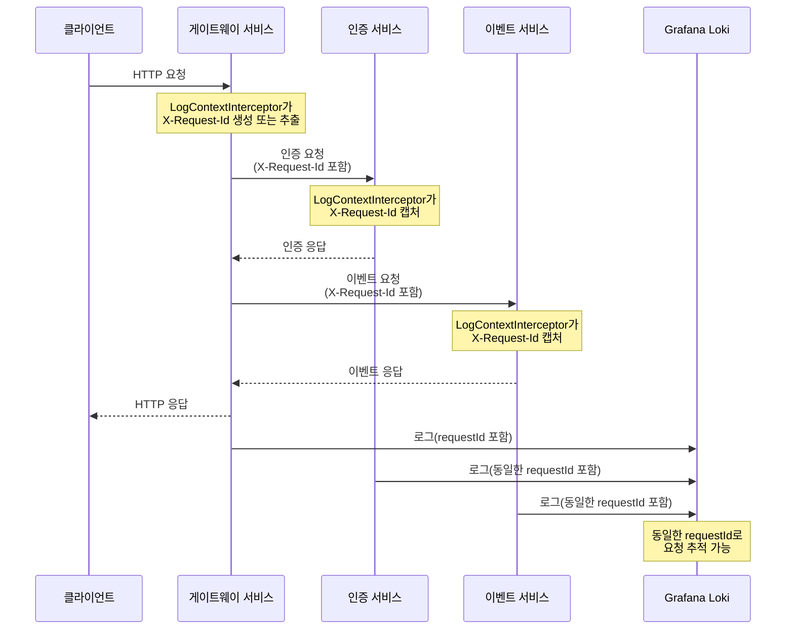

# 이벤트 리워드 플랫폼

NestJS를 사용한 이벤트 및 리워드 관리를 위한 마이크로서비스 기반 애플리케이션입니다.

## 아키텍처

이 플랫폼은 세 가지 주요 서비스로 구성됩니다:

1. **게이트웨이 서비스**: API 게이트웨이 역할을 하며 클라이언트의 HTTP 요청을 처리합니다.
2. **인증 서비스**: 인증 및 사용자 관리를 담당합니다.
3. **이벤트 서비스**: 이벤트 및 리워드를 관리합니다.

### 시스템 아키텍처 다이어그램


### 로깅 시스템 아키텍처


### 상세 아키텍처

- **마이크로서비스 통신**: 서비스 간 통신은 TCP/IP 프로토콜을 통해 이루어집니다.
- **데이터베이스**: 각 서비스는 자체 MongoDB 인스턴스를 사용합니다.
- **로깅**: 중앙 집중식 로깅 시스템은 Grafana Loki와 Alloy를 사용합니다.
- **API 게이트웨이**: REST API와 Swagger 문서를 제공합니다.

## 개발 환경 설정

### 필수 조건

- Node.js (v18+)
- pnpm
- Docker 및 Docker Compose

### Makefile을 사용한 초기화 및 관리

프로젝트를 쉽게 초기화하고 관리하기 위해 Makefile을 제공합니다:

```bash
# 키 생성 및 서비스 시작 (초기 설정)
make init

# 모든 서비스 시작
make up

# 로깅 서비스와 함께 시작
make up-with-logs

# 모든 서비스 중지
make down

# 모든 서비스 재시작
make restart

# 로그 확인
make logs

# 로그 실시간 확인
make logs-follow

# 실행 중인 서비스 목록 확인
make ps

# k6 테스트 실행 (테스트 데이터 시드 포함)
make k6

# 모든 테스트 실행 (단위 테스트 및 유스케이스 테스트)
make test
```

### 수동 설치

저장소를 복제하고 종속성을 설치합니다:

```bash
git clone <repository-url>
cd event-server
pnpm install
```

## 테스트 실행

### 단위 테스트 및 통합 테스트

```bash
# 모든 테스트 실행 (테스트 유저 시드 및 유스케이스 테스트 포함)
make test

# 또는 pnpm으로 직접 실행
pnpm test

# 특정 서비스의 테스트 실행
cd apps/auth && pnpm test
cd apps/event && pnpm test
cd apps/gateway && pnpm test
```

### 유스케이스 테스트

유스케이스 테스트는 특정 비즈니스 시나리오를 검증합니다:

```bash
# 또는 스크립트 직접 실행
bash scripts/run-usecase-tests.sh
```

### 성능 테스트 (k6)

k6를 사용하여 성능 테스트를 실행합니다:

```bash
# k6 성능 테스트 실행 (테스트 데이터 자동 시드)
make k6 # 동작 여부 확인
make k6 --all --full # 전체 실험 순차적으로 실행
```

## API 문서

Swagger 문서는 다음에서 확인할 수 있습니다:

```
http://localhost:3333/docs
```

Swagger UI는 다음을 제공합니다:

- 대화형 API 문서
- 모든 엔드포인트 테스트 기능
- JWT 토큰을 사용한 인증

## 로깅 시스템

애플리케이션은 중앙 집중식 로그 관리를 위해 Grafana Loki 및 Grafana Alloy와 함께 구조화된 JSON 로깅을 사용합니다. `@libs/logger` 패키지를 통해 다음과 같은 기능을 제공합니다:

- **구조화된 JSON 로깅**: Pino 기반의 JSON 형식 로그로 분석 및 검색이 용이합니다.
- **요청 컨텍스트 자동 캡처**: HTTP 메서드, 경로, 상태 코드 등의 요청 정보를 자동으로 캡처합니다.
- **요청 ID 전파**: 서비스 간 요청 추적을 위한 requestId를 자동으로 전파합니다.
- **비동기 로컬 스토리지**: 비동기 작업 간에도 로깅 컨텍스트가 유지됩니다.
- **민감 데이터 마스킹**: 비밀번호, 토큰 등 민감한 정보를 자동으로 마스킹합니다.
- **메서드 실행 추적**: `@LogExecution()` 데코레이터를 사용하여 메서드 호출 및 실행 시간을 자동으로 로깅합니다.
- **로그 레벨 관리**: 환경에 따라 로그 레벨을 다르게 설정할 수 있습니다.
- **Grafana Alloy 통합**: 로그가 자동으로 Loki에 저장되고 Grafana를 통해 조회 가능합니다.

### 모듈 설정

```typescript
import { Module } from "@nestjs/common";
import { LoggerModule } from "@libs/logger";

@Module({
  imports: [
    LoggerModule.forRootAsync({
      global: true,
      imports: [],
      inject: [],
      useFactory: async () => ({
        serviceName: "my-service", // 로그의 serviceId로 표시됨
        prettyPrint: process.env.NODE_ENV !== "production", // 개발 환경에서는 보기 좋은 형식으로 출력
        logLevel: process.env.LOG_LEVEL || "info",
        sensitiveDataOptions: {
          enabled: true,
          maskValue: "***MASKED***",
          objectPaths: [
            "req.headers.authorization",
            "req.headers.cookie",
            "req.body.password",
          ],
        },
        // Alloy 통합 설정
        alloyConfig: {
          enabled: true,
          messageKey: "msg",
          levelKey: "level",
        },
      }),
    }),
  ],
})
export class AppModule {}
```

### LogContextInterceptor를 이용한 요청 ID 주입

`LogContextInterceptor`는 모든 들어오는 HTTP 요청에 자동으로 고유한 requestId를 생성하고 로깅 컨텍스트에 추가합니다. 만약 요청에 이미 `X-Request-Id` 헤더가 있다면 해당 값을 사용합니다.

```typescript
import { Module } from "@nestjs/common";
import { APP_INTERCEPTOR } from "@nestjs/core";
import { LogContextInterceptor, LoggerModule } from "@libs/logger";

@Module({
  imports: [
    LoggerModule.forRootAsync({
      // 로거 설정...
    }),
  ],
  providers: [
    // 전역 인터셉터로 등록
    {
      provide: APP_INTERCEPTOR,
      useClass: LogContextInterceptor,
    },
  ],
})
export class AppModule {}
```

또는 main.ts에서 전역 인터셉터로 등록할 수 있습니다:

```typescript
import { NestFactory } from "@nestjs/core";
import { AppModule } from "./app.module";
import { LogContextInterceptor, PinoLoggerService } from "@libs/logger";

async function bootstrap() {
  const app = await NestFactory.create(AppModule);

  // 인터셉터 등록
  app.useGlobalInterceptors(app.get(LogContextInterceptor));

  await app.listen(3000);
}
bootstrap();
```

### 요청 추적 아키텍처

아래 다이어그램은 `LogContextInterceptor`를 사용한 요청 ID 전파 과정을 보여줍니다:



인터셉터는 다음 기능을 수행합니다:

- HTTP 요청에서 `X-Request-Id` 헤더를 추출하거나 없는 경우 UUID를 생성
- 클라이언트 IP, 사용자 에이전트, 요청 경로, HTTP 메서드 등 추출
- 응답 상태 코드와 성공/실패 여부 기록
- 비동기 작업 간에도 컨텍스트 유지
- 요청 처리 중 발생한 오류 자동 기록

### 로거 사용 예제

```typescript
import { Injectable } from "@nestjs/common";
import { PinoLoggerService } from "@libs/logger";

@Injectable()
export class AppService {
  constructor(private readonly logger: PinoLoggerService) {
    // 모든 로그에 컴포넌트 정보 추가
    this.logger.setContext({ component: "AppService" });
  }

  doSomething(data: any): void {
    // 일반 로그
    this.logger.info("작업 시작", { dataId: data.id });

    try {
      // 비즈니스 로직...
    } catch (error) {
      // 에러 로깅 (스택 트레이스 포함)
      this.logger.error("작업 실패", error.stack, { dataId: data.id });
    }
  }
}
```

### 메서드 실행 로깅

`@LogExecution` 데코레이터를 사용하여 메서드 호출, 결과, 실행 시간 및 오류를 자동으로 로깅할 수 있습니다:

```typescript
import { Injectable } from "@nestjs/common";
import { LogExecution } from "@libs/logger";

@Injectable()
export class UserService {
  constructor(private readonly logger: PinoLoggerService) {}

  @LogExecution({
    entryLevel: "debug", // 메서드 진입 시 로그 레벨
    exitLevel: "debug", // 메서드 종료 시 로그 레벨
    errorLevel: "error", // 오류 발생 시 로그 레벨
    logParams: true, // 매개변수 로깅 여부
    logResult: true, // 결과 로깅 여부
    logExecutionTime: true, // 실행 시간 로깅 여부
  })
  async getUser(userId: string) {
    // 비즈니스 로직...
    return { id: userId, name: "John Doe" };
  }
}
```

### 요청 ID 전파

서비스 간 요청을 추적하기 위해 요청 ID를 전파하는 예제:

```typescript
import { Injectable } from "@nestjs/common";
import { HttpService } from "@nestjs/axios";
import { LogContextStore } from "@libs/logger";

@Injectable()
export class ApiService {
  constructor(
    private readonly httpService: HttpService,
    private readonly logContextStore: LogContextStore,
  ) {}

  async callAnotherService() {
    // 현재 요청 ID 가져오기
    const requestId = this.logContextStore.getRequestId();

    // 다른 서비스로 요청 시 헤더에 요청 ID 추가
    const headers = { "X-Request-Id": requestId };

    // 요청 ID가 포함된 HTTP 요청
    return await this.httpService
      .get("http://another-service/api", { headers })
      .toPromise();
  }
}
```

### 로그 보기

Grafana는 `http://localhost:3000`에서 기본 자격 증명 `admin/admin`으로 사용할 수 있습니다.

사전 구성된 대시보드에는 다음이 포함됩니다:

- 요청 추적 대시보드: 서비스 간 요청을 추적하기 위해 requestId별로 그룹화된 로그 표시
- 로그 뷰어: 필터링 기능이 있는 일반 로그 뷰어

### Loki 쿼리 예제

- 모든 로그: `{container=~".+"}`
- 특정 서비스의 로그: `{service="gateway"}`
- 특정 요청 추적: `{requestId="specific-request-id"}`
- 오류 로그: `{level="error"}`
- 특정 사용자의 로그: `{userId="user123"}`
- 특정 경로의 요청 로그: `{path="/api/users"}`

## 서비스

### 게이트웨이 서비스

- 마이크로서비스 포트: 3010 (내부 포트 3000에 매핑됨)
- HTTP 포트: 3333 (REST API 및 Swagger용)

### 인증 서비스

- 마이크로서비스 포트: 3001

### 이벤트 서비스

- 마이크로서비스 포트: 3002

## 데이터베이스

각 서비스에는 자체 MongoDB 인스턴스가 있습니다:

- 인증 서비스: mongodb://mongo-user:27017/user-db
- 이벤트 서비스: mongodb://mongo-event:27017/event-db

db 인스턴스 자체를 분리한 이유는 아래 입니다.

1. User 데이터는 사람의 개인정보를 다룬다는 점에서 유의가 필요합니다.
2. Event 데이터는 중복, 재처리등에서 비교적 자유롭습니다.
3. 차후 보안과 관련하여 철저한 암호화 처리 등의 필요성이 발생할 경우, 인스턴스 레벨에서 분리가 필요할 수 있습니다.
4. 현재 개발한 버전은 굳이 비용을 걱정할 필요가 없습니다.
