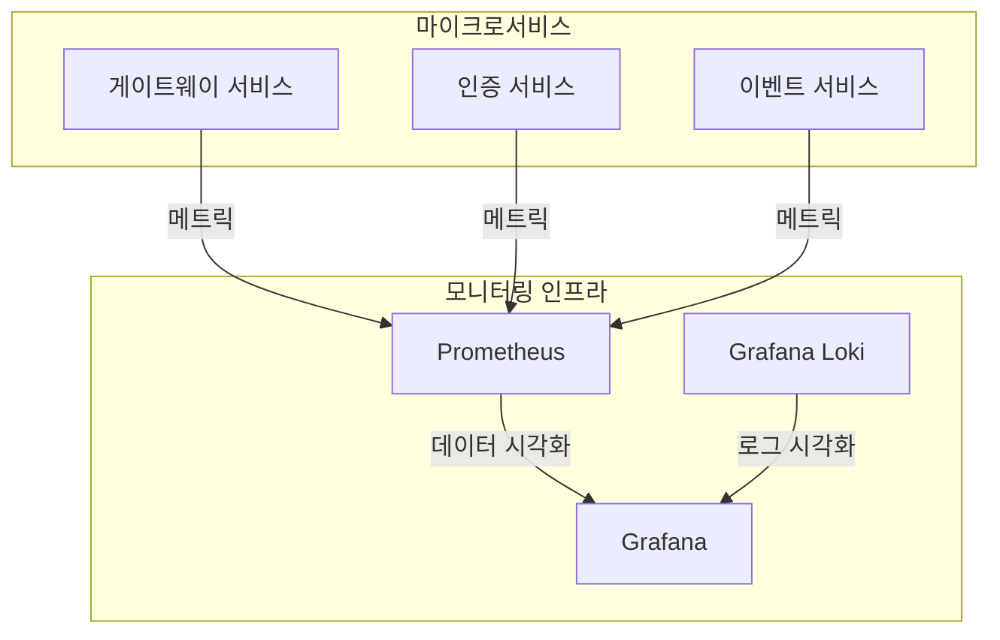
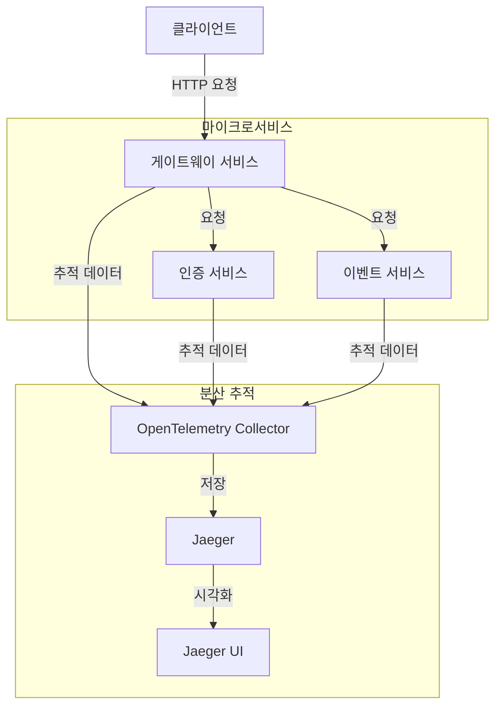

# 모니터링 시스템 개선 계획

현재 이벤트 리워드 플랫폼의 로깅 및 모니터링 시스템은 기본적인 기능을 제공하고 있으나, 프로덕션 환경에서의 안정적인 운영과 문제 해결을 위해 몇 가지 중요한 개선이 필요합니다. 이 문서는 모니터링 시스템의 현재 상태를 분석하고 향후 개선 방향을 제시합니다.

## 현재 모니터링 시스템 상태

### 장점

- Grafana Loki와 Grafana Alloy를 사용한 중앙 집중식 로깅 구현
- 마이크로서비스 간 요청 추적을 위한 요청 ID 전파 구현
- 민감 데이터 마스킹 처리
- @LogExecution 데코레이터를 통한 메서드 실행 로깅

### 한계

- 심층적인 모니터링 대시보드 부재
- 알림 시스템 미구현
- 서비스 상태 모니터링 부족
- 서비스 지표(메트릭) 수집 불완전
- 로그 보존 정책 미설정
- 분산 추적 기능 제한적

## 개선 계획

### 1. 모니터링 인프라 확장

#### 프로메테우스 통합

- **NestJS Prometheus 모듈 통합**: 각 마이크로서비스에 `@willsoto/nestjs-prometheus` 모듈 추가
- **커스텀 메트릭 구현**: 비즈니스 프로세스별 핵심 지표 정의 및 수집
- **스크레이핑 설정**: 각 서비스 메트릭 수집을 위한 프로메테우스 설정

#### 헬스체크 엔드포인트 개선

- **심층 헬스체크**: 데이터베이스 연결, Redis 연결 등 의존성 상태 확인
- **Kubernetes 친화적 헬스체크**: readiness/liveness 프로브 지원

### 2. 로깅 시스템 개선

#### 로그 필터링 최적화

- **구조화된 로그 형식 표준화**: 모든 서비스에서 일관된 로그 필드 구조 적용
- **로그 레이블 전략**: 효율적인 쿼리를 위한 핵심 메타데이터 레이블 정의
  - 서비스명, 환경, 컴포넌트, 로그 레벨, 요청 ID 등

#### 로그 보존 정책 구현

- **로그 유형별 보존 기간 설정**:
  - 일반 로그: 15일
  - 오류 로그: 30일
  - 보안 관련 로그: 90일
- **로그 압축 및 아카이빙**: 오래된 로그의 효율적인 저장을 위한 전략

### 3. 알림 시스템 구현

#### Grafana 알림 규칙

- **API 에러율 알림**: 특정 임계값(예: 5분간 5% 이상)을 초과하는 경우 알림
- **응답 시간 알림**: P95 응답 시간이 임계값을 초과하는 경우 알림
- **메모리/CPU 사용량 알림**: 리소스 사용량이 임계값을 초과하는 경우 알림
- **데이터베이스 연결 알림**: 연결 실패 또는 지연 시 알림

#### 알림 채널 다양화

- **Slack 통합**: 팀 협업 도구와 통합하여 실시간 알림
- **이메일 알림**: 중요 알림에 대한 이메일 발송
- **PagerDuty 통합**: 심각한 문제에 대한 온콜 알림

### 4. 비즈니스 메트릭 대시보드

#### 사용자 활동 대시보드

- **활성 사용자 수**: 일/주/월별 활성 사용자 추이
- **신규 가입자 수**: 일/주/월별 신규 가입자 추이
- **사용자 참여율**: 이벤트별 참여 비율

#### 이벤트 성과 대시보드

- **이벤트 참여도**: 이벤트별 사용자 참여율
- **리워드 요청 성공률**: 승인된 리워드 요청 비율
- **이벤트 타임라인**: 시간대별 이벤트 활동 분포

#### 시스템 성능 대시보드

- **API 응답 시간**: 엔드포인트별 응답 시간 분포
- **에러율**: 시간대별, 엔드포인트별 에러 발생률
- **리소스 사용량**: 서비스별 CPU, 메모리 사용 추이

### 5. 분산 추적 시스템 도입

#### OpenTelemetry 통합

- **OpenTelemetry 인스트루먼테이션**: 모든 서비스에 OpenTelemetry 통합
- **Jaeger 통합**: 분산 추적 데이터의 시각화 및 분석
- **컨텍스트 전파**: 서비스 간 추적 컨텍스트의 효과적인 전파

### 6. 실시간 대시보드

#### 상태 모니터링

- **서비스 상태 표시**: 각 마이크로서비스의 실시간 상태 표시
- **종합 시스템 상태**: 전체 시스템의 건강 상태 시각화

#### 비즈니스 활동 모니터링

- **실시간 사용자 활동**: 현재 활성 사용자 수 및 활동 유형
- **실시간 이벤트 참여**: 진행 중인 이벤트의 참여 현황
- **실시간 리워드 요청**: 최근 리워드 요청 및 처리 상태

## 구현 로드맵

### 1단계: 기본 모니터링 인프라 구축 (1-2주)

- Prometheus 설정 및 NestJS 통합
- 기본 헬스체크 엔드포인트 구현
- 로그 형식 및 레이블 표준화

### 2단계: 알림 시스템 및 대시보드 구축 (2-3주)

- Grafana 알림 규칙 설정
- 알림 채널 통합
- 핵심 비즈니스 및 시스템 대시보드 구현

### 3단계: 분산 추적 및 고급 기능 구현 (3-4주)

- OpenTelemetry 및 Jaeger 통합
- 실시간 대시보드 구현
- 로그 보존 정책 적용

## 결론

제안된 모니터링 시스템 개선은 이벤트 리워드 플랫폼의 운영 안정성과 가시성을 크게 향상시킬 것입니다. 이러한 개선을 통해 문제를 사전에 감지하고, 신속하게 대응하며, 비즈니스 성과를 더 잘 이해할 수 있게 될 것입니다. 개선 작업은 단계적으로 진행하여 각 단계가 완료될 때마다 즉각적인 가치를 제공할 수 있도록 계획되었습니다.
