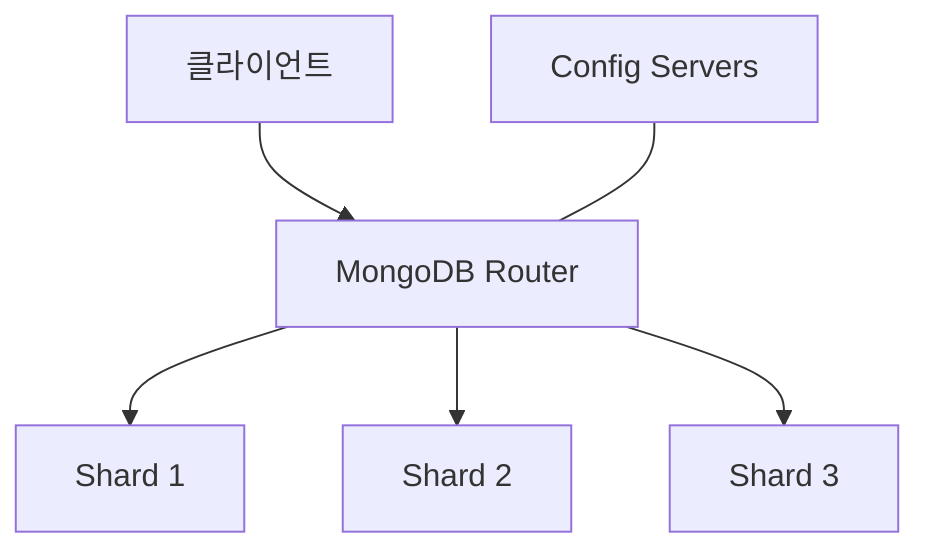
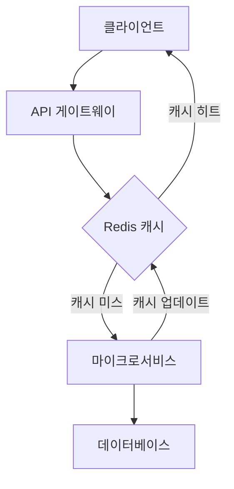
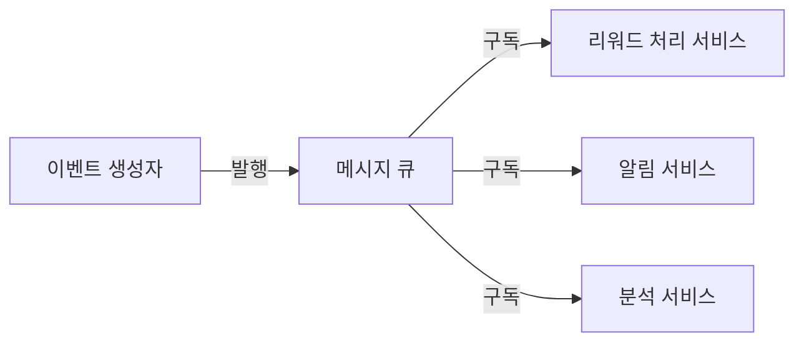

# 확장성 개선 방안

이벤트 리워드 플랫폼은 사용자 수, 이벤트 수, 리워드 요청 수가 증가함에 따라 원활하게 확장될 수 있어야 합니다. 이 문서는 현재 아키텍처의 확장성 평가와 향후 개선 방안을 제시합니다.

## 현재 아키텍처 평가

### 장점

- 마이크로서비스 아키텍처 채택으로 서비스별 독립적 확장 가능
- Docker 컨테이너화로 인한 배포 유연성
- MongoDB를 사용한 수평적 확장 가능성
- 서비스 간 비동기 통신 패턴 부분 적용

### 한계점

- 데이터베이스 확장 전략 미흡
- 서비스 디스커버리 메커니즘 부재
- 로드 밸런싱 전략 미구현
- 캐싱 레이어 부재
- 스테이트풀(Stateful) 서비스 의존성
- 비동기 처리 제한적 사용

## 확장성 개선 전략

### 1. 데이터베이스 확장 전략

#### MongoDB 샤딩 구현



- **샤딩 키 선택**: 효율적인 데이터 분산을 위한 최적의 샤딩 키 선정

  - 사용자 데이터: 사용자 ID 또는 지역 기반
  - 이벤트 데이터: 이벤트 ID 또는 날짜 기반
  - 리워드 요청: 요청 ID 또는 사용자 ID 기반

- **인덱스 최적화**: 쿼리 패턴에 맞는 인덱스 설계

#### 읽기/쓰기 분리

- **읽기 전용 복제본 구성**: 읽기 작업을 위한 별도의 복제본 설정
- **트래픽 유형 분리**: 분석 쿼리와 트랜잭션 쿼리 분리 처리

```typescript
@Injectable()
export class DatabaseService {
  constructor(
    @InjectConnection("writeConnection") private writeConnection: Connection,
    @InjectConnection("readConnection") private readConnection: Connection,
  ) {}

  async find(query: any): Promise<any[]> {
    // 읽기 연결 사용
    return this.readConnection.collection("items").find(query).toArray();
  }

  async create(data: any): Promise<any> {
    // 쓰기 연결 사용
    return this.writeConnection.collection("items").insertOne(data);
  }
}
```

### 2. 서비스 확장 전략

#### 수평적 확장 지원

- **서비스 디스커버리 도입**: Consul 또는 etcd 통합
- **Kubernetes 기반 오케스트레이션**: 자동 스케일링 및 배포 관리

```yaml
# 예시 Kubernetes Deployment
apiVersion: apps/v1
kind: Deployment
metadata:
  name: event-service
spec:
  replicas: 3
  selector:
    matchLabels:
      app: event-service
  template:
    metadata:
      labels:
        app: event-service
    spec:
      containers:
        - name: event-service
          image: event-reward-platform/event-service:latest
          resources:
            limits:
              cpu: "1"
              memory: "1Gi"
            requests:
              cpu: "0.5"
              memory: "512Mi"
          ports:
            - containerPort: 3002
```

#### 자동 스케일링 정책

- **CPU/메모리 기반 스케일링**: 리소스 사용량에 따른 자동 확장
- **커스텀 메트릭 기반 스케일링**: 요청 대기열 길이, 응답 시간 등 기반 확장

```yaml
# 예시 Horizontal Pod Autoscaler
apiVersion: autoscaling/v2
kind: HorizontalPodAutoscaler
metadata:
  name: event-service-hpa
spec:
  scaleTargetRef:
    apiVersion: apps/v1
    kind: Deployment
    name: event-service
  minReplicas: 2
  maxReplicas: 10
  metrics:
    - type: Resource
      resource:
        name: cpu
        target:
          type: Utilization
          averageUtilization: 70
    - type: Resource
      resource:
        name: memory
        target:
          type: Utilization
          averageUtilization: 80
```

### 3. 분산 캐싱 전략

#### Redis 캐싱 레이어 도입



- **읽기 작업 캐싱**: 자주 요청되는 데이터 캐싱
- **API 응답 캐싱**: 특정 API 응답 결과 캐싱
- **분산 캐시 클러스터**: 고가용성 Redis 클러스터 구성

```typescript
@Injectable()
export class CacheService {
  constructor(
    private readonly redisService: RedisService,
    private readonly logger: PinoLoggerService,
  ) {}

  async get<T>(key: string): Promise<T | null> {
    try {
      const cachedData = await this.redisService.get(key);
      if (cachedData) {
        return JSON.parse(cachedData);
      }
      return null;
    } catch (error) {
      this.logger.error(`Cache get error: ${error.message}`, error.stack);
      return null; // 캐시 오류 시 null 반환하고 원본 소스에서 데이터 조회
    }
  }

  async set(key: string, value: any, ttl: number = 3600): Promise<void> {
    try {
      await this.redisService.set(key, JSON.stringify(value), "EX", ttl);
    } catch (error) {
      this.logger.error(`Cache set error: ${error.message}`, error.stack);
    }
  }
}
```

#### 캐싱 전략

- **이벤트 목록**: 짧은 TTL로 캐싱 (1-5분)
- **사용자 프로필**: 중간 TTL로 캐싱 (10-30분)
- **참조 데이터**: 긴 TTL로 캐싱 (1시간+)
- **캐시 무효화**: 데이터 변경 시 관련 캐시 자동 무효화

### 4. 비동기 처리 아키텍처

#### 메시지 큐 시스템 도입



- **RabbitMQ 또는 Kafka 도입**: 비동기 메시지 처리를 위한 메시지 브로커 통합
- **이벤트 소싱 패턴 적용**: 상태 변경을 이벤트로 기록하고 처리

```typescript
// 메시지 생산자 예시
@Injectable()
export class EventPublisher {
  constructor(
    @InjectQueue("events") private eventsQueue: Queue,
    private readonly logger: PinoLoggerService,
  ) {}

  async publishEvent(eventType: string, payload: any): Promise<void> {
    try {
      await this.eventsQueue.add(
        eventType,
        {
          payload,
          timestamp: new Date().toISOString(),
        },
        {
          attempts: 3,
          backoff: {
            type: "exponential",
            delay: 1000,
          },
        },
      );
      this.logger.info(`Event published: ${eventType}`);
    } catch (error) {
      this.logger.error(
        `Event publishing failed: ${error.message}`,
        error.stack,
      );
      throw error;
    }
  }
}

// 메시지 소비자 예시
@Processor("events")
export class EventConsumer {
  constructor(private readonly logger: PinoLoggerService) {}

  @Process("reward.requested")
  async handleRewardRequest(job: Job<any>): Promise<void> {
    const { payload } = job.data;
    this.logger.info(`Processing reward request: ${payload.requestId}`);

    try {
      // 비동기 리워드 처리 로직
      // ...

      this.logger.info(`Reward request processed: ${payload.requestId}`);
    } catch (error) {
      this.logger.error(
        `Reward processing failed: ${error.message}`,
        error.stack,
      );
      throw error; // 자동 재시도를 위해 오류 발생
    }
  }
}
```

#### 비동기 워크플로우 도입

- **장기 실행 작업의 비동기 처리**: 리워드 요청 검증, 대량 이벤트 처리 등
- **분석 처리 분리**: 사용자 활동 분석, 이벤트 통계 등을 비동기로 처리
- **배치 처리**: 대량 데이터 처리를 위한 배치 작업 구현

### 5. API 최적화

#### API 게이트웨이 강화

- **응답 압축**: gzip 또는 Brotli 압축 적용
- **응답 필터링**: GraphQL 또는 커스텀 필터링으로 필요한 데이터만 반환
- **페이지네이션 최적화**: 커서 기반 페이지네이션 구현

```typescript
@Controller("events")
export class EventController {
  @Get()
  async getEvents(
    @Query("cursor") cursor: string,
    @Query("limit") limit: number = 20,
  ): Promise<PaginatedResponse<EventResponseDto>> {
    // 커서 기반 페이지네이션 구현
    const events = await this.eventService.findEvents(cursor, limit + 1);

    let nextCursor = null;
    if (events.length > limit) {
      // 마지막 항목은 다음 페이지의 첫 항목
      const nextItem = events.pop();
      nextCursor = nextItem.id;
    }

    return {
      items: events,
      nextCursor,
      hasMore: nextCursor !== null,
    };
  }
}
```

#### 요청 배치 처리

- **벌크 작업 API**: 여러 항목의 일괄 생성/업데이트/삭제
- **트랜잭션 지원**: 여러 작업의 원자적 실행 보장

### 6. 인프라 확장성

#### 클라우드 네이티브 아키텍처

- **컨테이너 오케스트레이션**: Kubernetes를 통한 서비스 관리
- **서비스 메시 도입**: Istio를 통한 트래픽 관리 및 보안
- **인프라 as 코드**: Terraform을 통한 인프라 프로비저닝

#### 다중 리전 배포

- **글로벌 로드 밸런싱**: 지리적으로 분산된 트래픽 처리
- **데이터 복제 전략**: 리전 간 데이터 동기화 메커니즘
- **지역별 캐싱**: CDN 및 엣지 캐싱 활용

## 구현 로드맵

### 1단계: 기본 확장성 개선

- Redis 캐싱 레이어 도입 (완)
- API 최적화 (압축, 페이지네이션) (완)
- 데이터베이스 인덱스 최적화 (완)
- 기본 수평 확장 지원 구현

### 2단계: 고급 확장성 기능

- 메시지 큐 시스템 통합 (완)
- 읽기/쓰기 분리 구현
- Kubernetes 기반 배포 자동화
- 자동 스케일링 정책 구현

### 3단계: 엔터프라이즈급 확장성

- MongoDB 샤딩 구현
- 서비스 메시 도입
- 다중 리전 배포 전략
- 고급 분석 및 모니터링 시스템

## 성능 목표

### 트래픽 처리 목표

- **동시 사용자**: 최대 10,000명의 동시 사용자 지원
- **API 요청**: 초당 1,000개 이상의 API 요청 처리
- **응답 시간**: P95 응답 시간 300ms 이하
- **가용성**: 99.9% 이상의 서비스 가용성

### 규모 확장 목표

- **이벤트 수**: 10,000개 이상의 동시 활성 이벤트 지원
- **사용자 수**: 100만 명 이상의 등록 사용자 지원
- **리워드 처리**: 시간당 10,000건 이상의 리워드 요청 처리

## 결론

제안된 확장성 개선 방안은 이벤트 리워드 플랫폼이 규모에 관계없이 효율적으로 운영될 수 있도록 합니다. 현재 마이크로서비스 아키텍처의 장점을 최대한 활용하면서, 데이터베이스 확장, 캐싱, 비동기 처리, 컨테이너 오케스트레이션 등의 기술을 도입하여 확장성과 성능을 향상시킬 수 있습니다.

단계적 접근 방식을 통해 가장 시급한 확장성 문제부터 해결하고, 점진적으로 고급 기능을 추가함으로써 서비스 중단 없이 플랫폼을 발전시킬 수 있습니다. 지속적인 성능 모니터링과 벤치마킹을 통해 확장성 개선의 효과를 측정하고 필요에 따라 전략을 조정해야 합니다.
