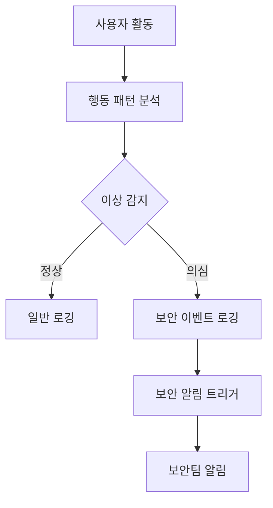

# 보안 강화 전략

이벤트 리워드 플랫폼의 보안은 사용자 데이터 보호와 서비스 무결성 유지에 필수적입니다. 이 문서는 현재 보안 상태를 분석하고 향후 강화 방안을 제시합니다.

## 현재 보안 구현

### 인증 및 인가

- JWT 기반 인증 시스템
- HTTP-only 쿠키를 통한 리프레시 토큰 관리
- 역할 기반 접근 제어(RBAC) 구현
- JwtAuthGuard와 RolesGuard를 통한 엔드포인트 보호

### 데이터 보호

- 민감 정보 마스킹 처리 (로깅)
- 사용자 비밀번호 해싱
- 분리된 데이터베이스를 통한 사용자 정보 격리

### 기반 보안

- Docker 컨테이너를 통한 격리
- 내부 네트워크를 통한 마이크로서비스 통신

## 개선이 필요한 영역

1. 암호화 전략 강화
2. 보안 모니터링 및 감사
3. 인증 시스템 강화
4. API 보안 향상
5. 데이터 보호 확장
6. 인프라 보안 강화

## 보안 강화 계획

### 1. 암호화 전략 강화

#### 전송 데이터 암호화

- **HTTPS 적용**: 모든 API 엔드포인트에 TLS 1.3 적용
- **상호 TLS(mTLS) 구현**: 마이크로서비스 간 통신 보안 강화
- **암호화 알고리즘 현대화**: 강력한 암호화 스위트 사용

#### 저장 데이터 암호화

- **민감 필드 암호화**: 개인식별정보(PII)에 필드 레벨 암호화 적용
  ```typescript
  // 암호화 데코레이터 예시
  @Entity()
  class User {
    @PrimaryGeneratedColumn()
    id: number;
    
    @Column()
    username: string;
    
    @Column()
    @Encrypted() // 필드 레벨 암호화
    email: string;
    
    @Column()
    @Encrypted()
    phoneNumber: string;
  }
  ```

- **데이터베이스 암호화**: MongoDB 엔터프라이즈 기능 또는 커스텀 솔루션을 통한 저장 데이터 암호화

### 2. 보안 모니터링 및 감사

#### 보안 이벤트 로깅

- **중요 보안 이벤트 로깅**: 로그인 시도, 역할 변경, 토큰 발급 등 보안 관련 이벤트 로깅
  ```typescript
  @Injectable()
  class SecurityAuditService {
    constructor(private readonly logger: PinoLoggerService) {}
    
    logSecurityEvent(eventType: SecurityEventType, data: any) {
      this.logger.info(`Security event: ${eventType}`, {
        securityEvent: true,
        eventType,
        ...data,
      });
    }
  }
  ```

- **감사 로그 분리**: 보안 이벤트를 위한 별도의 로그 스트림 구성
- **로그 무결성 보장**: 로그 변조 방지를 위한 암호화 서명 또는 블록체인 기반 로그 저장

#### 이상 탐지

- **로그인 시도 모니터링**: 비정상적인 로그인 패턴 탐지
- **비정상 행동 감지**: 사용자 행동 패턴 분석을 통한 이상 활동 탐지
- **자동화된 알림**: 의심스러운 활동 발견 시 자동 알림



### 3. 인증 시스템 강화

#### 다중 인증(MFA) 구현

- **OTP 구현**: Google Authenticator 또는 유사 서비스 통합
  ```typescript
  @Injectable()
  class MfaService {
    async generateSecret(userId: string): Promise<string> {
      // 사용자별 OTP 비밀 생성
    }
    
    async validateToken(userId: string, token: string): Promise<boolean> {
      // 제공된 토큰 검증
    }
  }
  ```

- **SMS/이메일 인증 추가**: 중요 작업 시 2차 인증 요구
- **관리자 계정 강화**: 관리자 계정에 필수적인 MFA 적용

#### 토큰 보안 강화

- **토큰 수명 최적화**: 액세스 토큰의 수명 단축 (15-30분)
- **토큰 무효화 메커니즘**: 중앙 집중식 토큰 무효화 시스템 구현
- **디바이스 지문**: 토큰에 디바이스 정보 바인딩
- **Refresh Token 회전**: 매 사용 시 새로운 리프레시 토큰 발급

### 4. API 보안 강화

#### 요청 제한 및 방어

- **속도 제한(Rate Limiting)**: 사용자별, IP별 API 호출 제한
  ```typescript
  import { Injectable } from '@nestjs/common';
  import { ThrottlerGuard } from '@nestjs/throttler';
  
  @Injectable()
  export class CustomThrottlerGuard extends ThrottlerGuard {
    protected getTracker(req: Record<string, any>): string {
      // IP와 사용자 ID 조합으로 트래커 생성
      const userId = req.user?.id || 'anonymous';
      return `${req.ip}-${userId}`;
    }
  }
  ```

- **API 키 관리**: 외부 서비스 통합을 위한 안전한 API 키 관리
- **CORS 정책 강화**: 명시적인 허용 오리진 설정

#### 입력 검증 강화

- **입력 검증 확장**: 모든 API 엔드포인트에 엄격한 입력 검증 적용
- **스키마 검증**: 정의된 DTO를 통한 JSON 스키마 검증
- **컨텐츠 보안 정책(CSP)**: 클라이언트 사이드 보안 강화

#### API 보안 헤더

- **보안 헤더 추가**: Helmet을 통한 보안 HTTP 헤더 설정
  ```typescript
  import helmet from 'helmet';
  
  // main.ts
  app.use(
    helmet({
      contentSecurityPolicy: {
        directives: {
          defaultSrc: ["'self'"],
          scriptSrc: ["'self'", "'unsafe-inline'"],
          styleSrc: ["'self'", "'unsafe-inline'"],
          imgSrc: ["'self'", 'data:'],
        },
      },
      xssFilter: true,
      noSniff: true,
      referrerPolicy: { policy: 'same-origin' },
    }),
  );
  ```

### 5. 데이터 보호 강화

#### 개인정보 보호

- **데이터 최소화**: 필요한 개인정보만 수집 및 저장
- **자동 익명화**: 불필요한 시점에 개인정보 자동 익명화 처리
- **데이터 접근 로깅**: 개인정보 접근 이벤트 로깅 및 모니터링

#### 데이터 무결성

- **서명 검증**: 중요 데이터에 디지털 서명 적용
- **변경 감지**: 중요 데이터 변경 이벤트 추적 및 검증
- **버전 관리**: 중요 데이터의 버전 이력 관리

### 6. 인프라 보안 강화

#### 컨테이너 보안

- **이미지 스캐닝**: 취약점 탐지를 위한 컨테이너 이미지 스캐닝
- **권한 최소화**: 컨테이너 실행 시 최소 권한 원칙 적용
- **보안 컨텍스트 설정**: 보안 강화를 위한 컨테이너 컨텍스트 설정

#### 네트워크 보안

- **네트워크 분리**: 마이크로서비스용 격리된 네트워크 구성
- **방화벽 규칙**: 엄격한 인바운드/아웃바운드 규칙 설정
- **API 게이트웨이 보안**: 게이트웨이 레벨에서의 보안 필터링

#### 취약점 관리

- **종속성 검사**: 정기적인 npm audit 및 취약점 스캔
- **패치 자동화**: 보안 패치 자동 적용 시스템 구축
- **보안 코드 리뷰**: 코드 배포 전 보안 중심 리뷰 프로세스

## 구현 로드맵

### 1단계: 즉시 개선 사항 (1-2주)

- 보안 헤더 구현 (Helmet)
- 입력 검증 강화
- npm 종속성 감사 및 업데이트
- 기본 속도 제한 구현

### 2단계: 핵심 보안 강화 (2-4주)

- HTTPS/TLS 구성
- 민감 필드 암호화 구현
- 토큰 보안 최적화
- 보안 로깅 확장

### 3단계: 고급 보안 기능 (4-8주)

- 다중 인증(MFA) 구현
- 이상 탐지 시스템 구축
- 마이크로서비스 간 mTLS 적용
- 토큰 무효화 메커니즘 구현

## 결론

제안된 보안 강화 전략은 이벤트 리워드 플랫폼의 전반적인 보안 태세를 강화하고, 사용자 데이터를 보호하며, 규제 준수를 지원할 것입니다. 각 단계는 현재 시스템에 점진적으로 통합될 수 있도록 설계되었으며, 단계적 구현을 통해 서비스 중단을 최소화하면서 보안을 지속적으로 향상시킬 수 있습니다.

보안은 지속적인 프로세스이며, 이 전략은 정기적인 검토와 업데이트를 통해 발전해야 합니다. 새로운 위협과 취약점에 대응하기 위해 보안 모니터링과 평가를 지속적으로 수행해야 합니다. 
