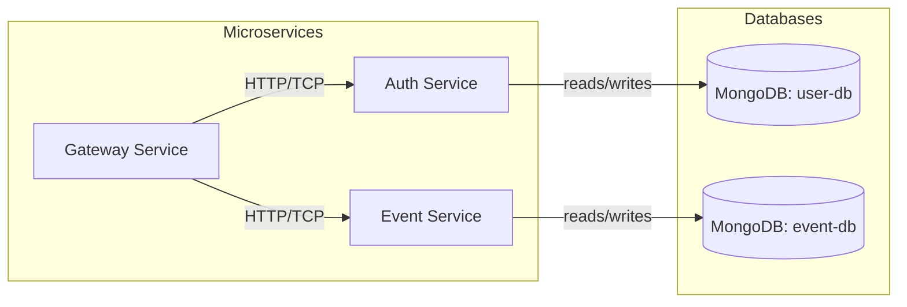

# 기술 사양

## 1. 소개

이 문서는 PRD(Event/Reward Management Platform Guide)에 정의된 이벤트 및 리워드 관리 플랫폼의 기술 아키텍처와 주요 설계 사항을 설명합니다.

- 마이크로서비스 아키텍처 및 서비스 경계
- 사용 기술 스택 및 버전
- 컨테이너화 및 배포 방식
- API 설계 및 데이터 모델
- 테스트 전략 및 E2E(use case)

---

## 2. 아키텍처

다음은 시스템의 주요 컴포넌트와 흐름을 보여주는 Mermaid 다이어그램입니다.



---

## 3. 기술 스택

| 구분          | 기술 및 버전                            |
| ------------- | --------------------------------------- |
| 프레임워크    | NestJS 11                               |
| 아키텍처 패턴 | Microservices Architecture              |
| ORM           | MikroORM 6.4.13                         |
| 데이터베이스  | MongoDB (2 인스턴스: user-db, event-db) |
| 컨테이너화    | Docker & Docker Compose                 |
| 테스트        | Jest + SuperTest                        |
| 언어          | TypeScript latest                       |

1. DB 구분 사유
   - user db의 경우, RDB를 사용하는 등의 변경이 발생할 수 있다는 점 고려

---

## 4. 인프라 구성

### 4.1 Docker Compose 예시

```yaml
services:
  gateway:
    build: ./apps/gateway
    networks:
      - app-net
    ports:
      - "3000:3000"

  auth:
    build: ./apps/auth
    networks:
      - app-net

  event:
    build: ./apps/event
    networks:
      - app-net

  mongo-user:
    image: mongo:latest
    container_name: mongo-user
    volumes:
      - user-data:/data/db
    networks:
      - app-net

  mongo-event:
    image: mongo:latest
    container_name: mongo-event
    volumes:
      - event-data:/data/db
    networks:
      - app-net

networks:
  app-net:

volumes:
  user-data:
  event-data:
```

---

## 5. API 설계

### 5.1 Gateway Service

- 인증/인가

  - `POST /auth/login` → Auth Service로 전달
  - `JwtAuthGuard`, `RolesGuard` 적용

- 프록시 엔드포인트

  - `POST /events` → Event Service (OPERATOR, ADMIN)
  - `GET  /events` → 이벤트 조회 (권한별 접근 가능)
  - `POST /rewards` → Event Service (OPERATOR, ADMIN)
  - `POST /events/:id/request-reward` → Event Service (USER)
  - `GET  /events/requests` → Event Service (USER, OPERATOR, AUDITOR, ADMIN)

### 5.2 Auth Service

- `POST /users` → 사용자 생성
- `GET  /users/:id` → 사용자 정보 조회
- `PUT  /users/:id/roles` → 역할 업데이트 (ADMIN)
- `POST /auth/login` → JWT 발급

### 5.3 Event Service

- `POST /events` → 이벤트 생성 (조건, 기간, 상태)
- `GET  /events` → 이벤트 목록/필터
- `POST /events/:eventId/rewards` → 이벤트에 리워드 등록
- `GET  /events/:eventId/rewards` → 리워드 목록 조회
- `POST /events/:eventId/request` → 사용자 리워드 요청
- `GET  /events/requests` → 리워드 요청 목록/필터

---

## 6. 데이터 모델

### 6.1 User DB (`user-db`)

```ts
@Entity()
export class User {
  @PrimaryKey()
  _id: ObjectId;

  @Property()
  email: string;

  @Property()
  passwordHash: string;

  @Property()
  roles: string[];

  @Property()
  createdAt: Date;
}
```

### 6.2 Event DB (`event-db`)

```ts
@Entity()
export class Event {
  @PrimaryKey()
  _id: ObjectId;

  @Property()
  name: string;

  @Property()
  condition: Record<string, any>;

  @Property()
  period: { start: Date; end: Date };

  @Property()
  status: "ACTIVE" | "INACTIVE";
}

@Entity()
export class EventReward {
  @PrimaryKey()
  _id!: ObjectId;

  @ManyToOne(() => Event)
  event!: Event;

  @ManyToOne(() => RewardBase)
  reward!: RewardBase;
}

@DiscriminatorColumn({
  fieldName: "type",
  values: ["POINT", "ITEM", "COUPON", "BADGE"],
})
@Entity()
export abstract class RewardBase {
  @PrimaryKey()
  _id!: ObjectId;

  @Property()
  type!: string;
}

@Entity({ discriminatorValue: "POINT" })
export class PointReward extends RewardBase {
  @Property()
  points!: number;
}

@Entity({ discriminatorValue: "ITEM" })
export class ItemReward extends RewardBase {
  @Property()
  itemId!: string;

  @Property()
  quantity!: number;
}

@Entity({ discriminatorValue: "COUPON" })
export class CouponReward extends RewardBase {
  @Property()
  couponCode!: string;

  @Property()
  expiry!: Date;
}

@Entity()
@Unique({ properties: ["user", "event"] })
export class RewardRequest {
  @PrimaryKey()
  _id: ObjectId;

  @Property()
  userId: ObjectId;

  @ManyToOne(() => Event)
  event: Event;

  @Property()
  status: "PENDING" | "APPROVED" | "REJECTED";

  @Property()
  createdAt: Date;
}
```

---

## 7. 인증 및 인가

- JWT: 공유 비밀키로 서명
- 역할(Role): `USER`, `OPERATOR`, `AUDITOR`, `ADMIN`
- 가드:

  - `JwtAuthGuard` — 인증된 사용자만 접근
  - `RolesGuard` — 지정된 역할만 접근

---

## 8. 테스트 전략

- 단위 테스트: Jest로 서비스, 컨트롤러, mongodb-memory-server로 동작 검증
- 통합 테스트: mongodb-memory-server + SuperTest
- E2E 테스트: Docker Compose로 전체 스택 기동 후 SuperTest로 시나리오 실행

### 8.1 E2E 테스트 Use Case

#### 시나리오: 사용자 리워드 요청 흐름

1. 사전조건

   - OPERATOR가 이벤트 생성 및 리워드 등록
   - 테스트용 사용자 계정 존재

2. 절차

   1. `POST /auth/login` → JWT 수신
   2. `POST /events/{eventId}/request` → 리워드 요청
   3. 조건 검증 (Event Service 내부)
   4. `RewardRequest` 문서 저장 (`status = PENDING`)
   5. `GET /events/requests?userId={userId}` → 요청 조회

3. 검증 포인트

   - 로그인 응답: `200 OK`
   - 요청 생성 응답: `201 Created`
   - 응답 본문에 올바른 `eventId`, `userId`, `status` 포함
   - 데이터베이스에 신규 `RewardRequest` 하나 생성

이 시나리오는 Jest + SuperTest 스크립트로 자동화되어, Docker Compose로 기동된 전체 시스템을 대상으로 검증됩니다.
