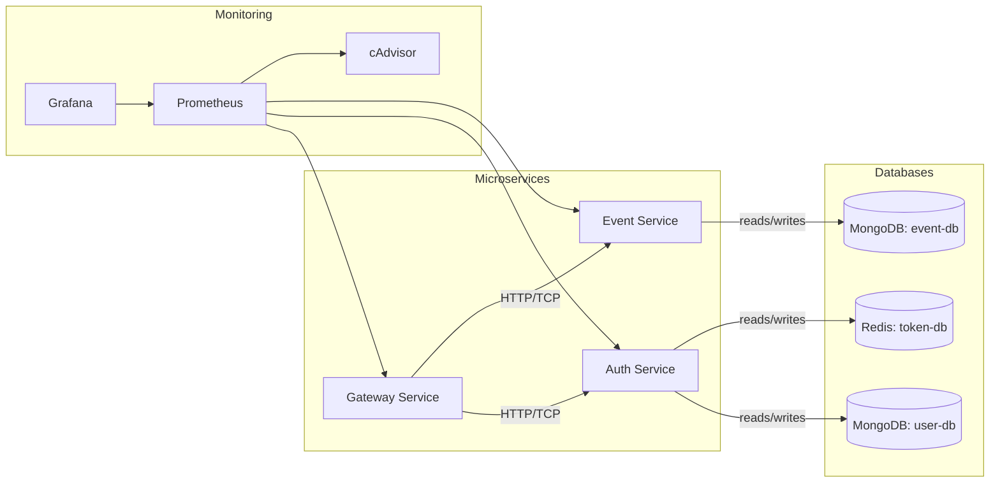

# 기술 사양

## 1. 소개

이 문서는 PRD(Event/Reward Management Platform Guide)에 정의된 이벤트 및 리워드 관리 플랫폼의 기술 아키텍처와 주요 설계 사항을 설명합니다.

- 마이크로서비스 아키텍처 및 서비스 경계
- 사용 기술 스택 및 버전
- 컨테이너화 및 배포 방식
- API 설계 및 데이터 모델
- 테스트 전략 및 E2E(use case)

---

## 2. 아키텍처

다음은 시스템의 주요 컴포넌트와 흐름을 보여주는 Mermaid 다이어그램입니다.



---

## 3. 기술 스택

| 구분           | 기술 및 버전                            |
| -------------- | --------------------------------------- |
| 프레임워크     | NestJS 11                               |
| 아키텍처 패턴  | Microservices Architecture              |
| ORM            | MikroORM 6                              |
| 데이터베이스   | MongoDB 8.0.9 (2 인스턴스: user-db, event-db) |
| 인메모리 DB    | Redis 7.2 (token-db)                    |
| 컨테이너화     | Docker & Docker Compose                 |
| 테스트         | Jest + SuperTest + k6 + redis-mock      |
| 언어           | TypeScript                              |
| 모니터링       | Prometheus + Grafana + cAdvisor         |
| 패키지 관리자  | pnpm 8.15.9                            |
| 빌드 도구      | Turbo                                   |

1. DB 구분 사유
   - user db의 경우, RDB를 사용하는 등의 변경이 발생할 수 있다는 점 고려
   - token db는 Redis를 사용하여 빠른 액세스 토큰 검증 및 무효화 지원

---

## 4. 인프라 구성

### 4.1 Docker Compose 구성

```yaml
services:
  # 모니터링 서비스
  prometheus:
    image: prom/prometheus:latest
    ports:
      - "9090:9090"
    volumes:
      - ../infrastructure/prometheus/prometheus.yml:/etc/prometheus/prometheus.yml
      - prometheus-data:/prometheus

  cadvisor:
    image: gcr.io/cadvisor/cadvisor:latest
    volumes:
      - /:/rootfs:ro
      - /var/run:/var/run:ro
      - /sys:/sys:ro
      - /var/lib/docker/:/var/lib/docker:ro
      - /dev/disk/:/dev/disk:ro
    ports:
      - "8080:8080"

  grafana:
    image: grafana/grafana:latest
    ports:
      - "3000:3000"
    volumes:
      - grafana-data:/var/lib/grafana
      - ../infrastructure/grafana/datasources.yaml:/etc/grafana/provisioning/datasources/datasources.yaml
      - ../infrastructure/grafana/dashboards.yaml:/etc/grafana/provisioning/dashboards/dashboards.yaml
      - ../infrastructure/grafana/dashboards:/etc/grafana/dashboards
    environment:
      - GF_SECURITY_ADMIN_PASSWORD=admin
      - GF_SECURITY_ADMIN_USER=admin
      - GF_USERS_ALLOW_SIGN_UP=false

  # 어플리케이션 서비스
  gateway:
    build:
      context: ../
      dockerfile: apps/gateway/docker/Dockerfile.dev
    ports:
      - "3010:3000"
      - "3333:3333"
    environment:
      - NODE_ENV=development
      - GATEWAY_HOST=0.0.0.0
      - GATEWAY_PORT=3000
      - HTTP_PORT=3333
      - AUTH_SERVICE_HOST=auth
      - AUTH_SERVICE_PORT=3001
      - EVENT_SERVICE_HOST=event
      - EVENT_SERVICE_PORT=3002

  auth:
    build:
      context: ../
      dockerfile: apps/auth/docker/Dockerfile.dev
    environment:
      - NODE_ENV=development
      - MONGODB_URI=mongodb://mongo-user:27017
      - REDIS_HOST=redis
      - REDIS_PORT=6379
    depends_on:
      - mongo-user
      - redis

  event:
    build:
      context: ../
      dockerfile: apps/event/docker/Dockerfile.dev
    environment:
      - NODE_ENV=development
      - MONGODB_URI=mongodb://mongo-event:27017
    depends_on:
      - mongo-event

  mongo-user:
    image: mongo:8.0.9
    ports:
      - "27017:27017"
    volumes:
      - user-data:/data/db

  mongo-event:
    image: mongo:8.0.9
    ports:
      - "27018:27017"
    volumes:
      - event-data:/data/db
      
  redis:
    image: redis:7.2-alpine
    ports:
      - "6379:6379"
    command: redis-server --appendonly yes
    volumes:
      - redis-data:/data

networks:
  event-network:

volumes:
  user-data:
  event-data:
  grafana-data:
  prometheus-data:
  redis-data:
```

---

## 5. API 설계

### 5.1 Gateway Service

- 인증/인가

  - `POST /auth/login` → Auth Service로 전달
  - `POST /auth/refresh` → Auth Service로 전달
  - `POST /auth/logout` → Auth Service로 전달
  - `JwtAuthGuard`, `RolesGuard` 적용

- 프록시 엔드포인트

  - `POST /events` → Event Service (OPERATOR, ADMIN)
  - `GET  /events` → 이벤트 조회 (권한별 접근 가능)
  - `POST /events/:eventId/rewards` → Event Service (OPERATOR, ADMIN)
  - `GET  /events/:eventId/rewards` → 리워드 목록 조회
  - `POST /events/:eventId/request` → 사용자 리워드 요청 (USER)
  - `GET  /events/requests` → Event Service (USER, OPERATOR, AUDITOR, ADMIN)

### 5.2 Auth Service

- `POST /users` → 사용자 생성
- `GET  /users/:id` → 사용자 정보 조회
- `PUT  /users/:id/roles` → 역할 업데이트 (ADMIN)
- `POST /auth/login` → JWT 발급
- `POST /auth/refresh` → Refresh Token으로 새 Access Token 발급
- `POST /auth/logout` → 사용자 토큰 무효화

### 5.3 Event Service

- `POST /events` → 이벤트 생성 (조건, 기간, 상태)
- `GET  /events` → 이벤트 목록/필터
- `POST /events/:eventId/rewards` → 이벤트에 리워드 등록
- `GET  /events/:eventId/rewards` → 리워드 목록 조회
- `POST /events/:eventId/request` → 사용자 리워드 요청
- `GET  /events/requests` → 리워드 요청 목록/필터

---

## 6. 데이터 모델

### 6.1 User DB (`user-db`)

```ts
@Entity()
export class User implements UserEntity {
  @PrimaryKey()
  _id!: ObjectId;

  @Property({ unique: true })
  email!: string;

  @Property()
  passwordHash!: string;

  @Property()
  roles: Role[] = [Role.USER];

  @Property()
  createdAt: Date = new Date();

  @Property()
  updatedAt: Date = new Date();

  get id(): string {
    return this._id.toString();
  }
}

@Entity()
export class UserToken implements UserTokenEntity {
  @PrimaryKey()
  _id!: ObjectId;

  @Property({ unique: true })
  userId!: string;

  @Property()
  refreshToken!: string;

  @Property()
  accessTokenHash!: string;

  @Property()
  expiresAt!: Date;

  @Property()
  createdAt: Date = new Date();

  @Property({ onUpdate: () => new Date() })
  updatedAt: Date = new Date();
}
```

### 6.2 Event DB (`event-db`)

```ts
@Entity()
export class Event implements EventEntity {
  @PrimaryKey()
  _id!: ObjectId;

  @Property()
  name!: string;

  @Property()
  condition!: Record<string, any>;

  @Property()
  periodStart!: Date;

  @Property()
  periodEnd: Date | null = null;

  @Property()
  status!: EventStatus;

  @Property()
  createdAt: Date = new Date();

  @Property({ onUpdate: () => new Date() })
  updatedAt: Date = new Date();
}

@Entity()
export class EventReward {
  @PrimaryKey()
  _id!: ObjectId;

  @ManyToOne(() => Event)
  event!: Event;

  @ManyToOne(() => RewardBase)
  reward!: RewardBase;
}

@Entity({
  collection: 'rewards',
  discriminatorColumn: 'type',
  discriminatorMap: {
    [RewardType.POINT]: 'PointReward',
    [RewardType.ITEM]: 'ItemReward',
    [RewardType.COUPON]: 'CouponReward',
    [RewardType.BADGE]: 'BadgeReward',
  },
  abstract: true,
})
export abstract class RewardBase implements RewardBaseEntity {
  @PrimaryKey()
  _id!: ObjectId;

  @Property()
  type!: RewardType;

  @Property()
  name!: string;

  @Property()
  createdAt: Date = new Date();

  @Property({ onUpdate: () => new Date() })
  updatedAt: Date = new Date();
}

@Entity({ discriminatorValue: RewardType.POINT })
export class PointReward extends RewardBase implements PointRewardEntity {
  @Property()
  points!: number;

  override type: RewardType.POINT = RewardType.POINT;
}

@Entity({ discriminatorValue: RewardType.ITEM })
export class ItemReward extends RewardBase implements ItemRewardEntity {
  @Property()
  itemId!: string;

  @Property()
  quantity!: number;

  override type: RewardType.ITEM = RewardType.ITEM;
}

@Entity({ discriminatorValue: RewardType.COUPON })
export class CouponReward extends RewardBase implements CouponRewardEntity {
  @Property()
  couponCode!: string;

  @Property()
  expiry!: Date;

  override type: RewardType.COUPON = RewardType.COUPON;
}

@Entity({ discriminatorValue: RewardType.BADGE })
export class BadgeReward extends RewardBase implements BadgeRewardEntity {
  @Property()
  badgeId!: string;

  override type: RewardType.BADGE = RewardType.BADGE;
}

@Entity()
@Unique({ properties: ["userId", "event"] })
export class RewardRequest {
  @PrimaryKey()
  _id!: ObjectId;

  @Property()
  userId!: string;

  @ManyToOne(() => Event)
  event!: Event;

  @Property()
  status!: RewardRequestStatus;

  @Property()
  createdAt: Date = new Date();

  @Property({ onUpdate: () => new Date() })
  updatedAt: Date = new Date();
}
```

---

## 7. 인증 및 인가

- JWT: 공유 비밀키로 서명
- 역할(Role): `USER`, `OPERATOR`, `AUDITOR`, `ADMIN`
- 가드:

  - `JwtAuthGuard` — 인증된 사용자만 접근
  - `RolesGuard` — 지정된 역할만 접근

### 7.1 토큰 관리

- **Access Token**: 짧은 수명(15분)의 JWT 토큰, API 접근에 사용, Redis에 저장 및 관리
- **Refresh Token**: 긴 수명(7일)의 토큰, 새로운 Access Token 발급에 사용, MongoDB에 저장
- **토큰 무효화**: 
  - 새 Access Token 발급 시 이전 토큰 무효화 (한 번에 하나의 유효한 세션만 허용)
  - 로그아웃 시 Redis에서 액세스 토큰 즉시 무효화
  - Redis에서 JWT 데이터 관리로 블랙리스트 및 유효성 검증 최적화
- **토큰 저장소**: 
  - Refresh Token은 MongoDB에 저장되며 사용자당 하나의 유효한 토큰만 유지
  - Access Token은 Redis에 저장되어 빠른 검증 및 무효화 지원

### 7.2 Auth Service API 확장

- `POST /auth/refresh`: Refresh Token으로 새 Access Token 발급
- `POST /auth/logout`: 현재 사용자의 모든 토큰 무효화 (Redis에서 즉시 무효화)

### 7.3 사용자 토큰 데이터 모델

#### MongoDB (UserToken)

```ts
@Entity()
export class UserToken {
  @PrimaryKey()
  _id!: ObjectId;

  @Property({ unique: true })
  userId!: string;

  @Property()
  refreshToken!: string;

  @Property()
  expiresAt!: Date;

  @Property()
  createdAt: Date = new Date();

  @Property({ onUpdate: () => new Date() })
  updatedAt: Date = new Date();
}
```

#### Redis (AccessToken)

Redis 키-값 구조:
- 키: `access_token:{userId}`
- 값: JSON 구조
  ```json
  {
    "token": "jwt_token_string",
    "issuedAt": "timestamp",
    "expiresAt": "timestamp"
  }
  ```

### 7.4 Redis 구현 및 테스트

Redis 클라이언트는 `ioredis` 라이브러리를 사용하여 구현합니다:

```ts
import { Redis } from 'ioredis';

@Injectable()
export class TokenService {
  private readonly redis: Redis;
  
  constructor(
    @Inject('REDIS_CLIENT') redisClient: Redis,
    private configService: ConfigService,
  ) {
    this.redis = redisClient;
  }
  
  async saveAccessToken(userId: string, token: string): Promise<void> {
    const key = `access_token:${userId}`;
    const tokenData = {
      token,
      issuedAt: new Date().toISOString(),
      expiresAt: new Date(Date.now() + 15 * 60 * 1000).toISOString(), // 15분
    };
    
    await this.redis.set(key, JSON.stringify(tokenData), 'EX', 15 * 60); // 15분 후 자동 만료
  }
  
  async invalidateAccessToken(userId: string): Promise<void> {
    const key = `access_token:${userId}`;
    await this.redis.del(key);
  }
  
  async validateAccessToken(userId: string, token: string): Promise<boolean> {
    const key = `access_token:${userId}`;
    const tokenDataStr = await this.redis.get(key);
    
    if (!tokenDataStr) {
      return false;
    }
    
    const tokenData = JSON.parse(tokenDataStr);
    return tokenData.token === token;
  }
}
```

테스트 환경에서는 `redis-mock` 패키지를 사용하여 인메모리 Redis 서버를 실행:

```ts
import * as RedisMock from 'redis-mock';
import { Redis } from 'ioredis';
import IoRedis from 'ioredis-mock';

// 테스트 모듈 설정
@Module({
  providers: [
    {
      provide: 'REDIS_CLIENT',
      useFactory: () => {
        if (process.env.NODE_ENV === 'test') {
          return new IoRedis(); // ioredis-mock 사용
        }
        return new Redis({
          host: process.env.REDIS_HOST || 'localhost',
          port: parseInt(process.env.REDIS_PORT || '6379', 10),
        });
      },
    },
    TokenService,
  ],
  exports: [TokenService],
})
export class TokenModule {}
```

---

## 8. 테스트 전략

- 단위 테스트: Jest로 서비스, 컨트롤러, mongodb-memory-server & ioredis-mock으로 동작 검증
- 통합 테스트: mongodb-memory-server + ioredis-mock + SuperTest
- 성능 테스트: k6를 사용한 부하 테스트
- E2E 테스트: Docker Compose로 전체 스택 기동 후 SuperTest로 시나리오 실행

### 8.1 k6 성능 테스트 

다음 커맨드로 성능 테스트를 실행할 수 있습니다:

```
npm run test:k6           # 기본 로그인 테스트
npm run test:k6:event-rewards # 이벤트 리워드 목록 성능 테스트
npm run test:k6:event-reward-request # 이벤트 리워드 요청 테스트
npm run test:k6:event-creation # 이벤트 생성 테스트
npm run test:k6:simple-login # 간단한 로그인 성능 테스트
```

### 8.2 E2E 테스트 시나리오

#### 시나리오: 사용자 리워드 요청 흐름

1. 사전조건

   - OPERATOR가 이벤트 생성 및 리워드 등록
   - 테스트용 사용자 계정 존재

2. 절차

   1. `POST /auth/login` → JWT 수신
   2. `POST /events/{eventId}/request` → 리워드 요청
   3. 조건 검증 (Event Service 내부)
   4. `RewardRequest` 문서 저장 (`status = PENDING`)
   5. `GET /events/requests?userId={userId}` → 요청 조회

3. 검증 포인트

   - 로그인 응답: `200 OK`
   - 요청 생성 응답: `201 Created`
   - 응답 본문에 올바른 `eventId`, `userId`, `status` 포함
   - 데이터베이스에 신규 `RewardRequest` 하나 생성

이 시나리오는 Jest + SuperTest 스크립트로 자동화되어, Docker Compose로 기동된 전체 시스템을 대상으로 검증됩니다.

### 8.3 모니터링 및 지표 수집

- Prometheus를 통한 메트릭 수집
- Grafana 대시보드를 통한 시각화
- cAdvisor를 통한 컨테이너 성능 모니터링
